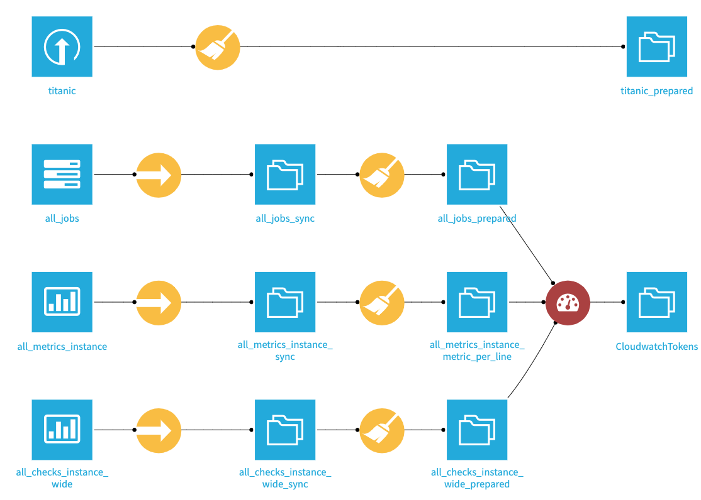

# DSSCloudWatch
Automatically push your metrics from Dataiku's Science Studio to Amazon's CloudWatch.

## How does it work
Get your metrics in AWS CloudWatch following this simple steps:
 * Create your metric dataset or datasets.
 * Pass DSSCloudWatch your metric datasets and create an output dataset where log information will be written.
 * Configure your `mazon User's Access Key` and `mazon User's Access Password` in the settings section. 
 * Automate dataset buildings with an scenario

Check your metrics at CloudWatch

### How to define your metrics
DSSCloudWatch input datasets should follow this schema:
 * Namespace: string Main section where thise metrics reside
 * MatricName: string Metric's name
 * MetricValue: [string, number] Metric's value
 * Timestamp: date Metric's timestamp
 * [Optional] MetricUnit: none,milliseconds,seconds,...
 * ... any other column present will be converted to `Dimensions`

 

 More info about CloudWatch metrics: https://boto3.amazonaws.com/v1/documentation/api/latest/reference/services/cloudwatch.html#CloudWatch.Client.put_metric_data

## Installing from repository
 * On your DSS instance go to `Administration > Plugins`
 * Select the `Advanced` option
 * Set the repository address https://github.com/TeliaDK/DSSCloudWatch
 * Use the `master` branch

